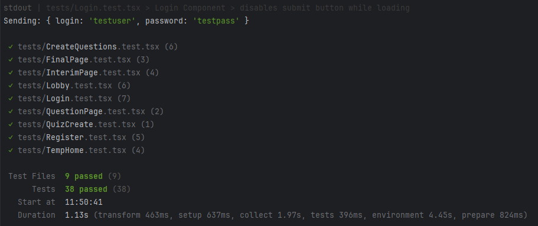
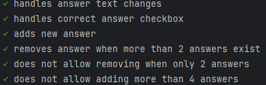
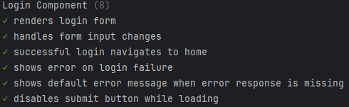
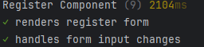

# **QuizHub**

**GitHub Репозиторий**: [QuizHub](#)

## **Участники проекта:**
- **Новохацкий Данил**  - 5130904/30104
- **Никитов Дмитрий**   - 5130904/30104
- **Бабинов Серафим**   - 5130904/30104
- **Степанов Геннадий** - 5130904/30104
- **Артемьев Максим**   - 5130904/30104
- **Лебедев Антон**     - 5130904/30104

---

## **Определение проблемы**

Преподавателям и организаторам мероприятий не хватает простого и эффективного инструмента для проведения интерактивных викторин и опросов в реальном времени. Существующие решения часто являются слишком сложными, избыточными или не предлагают ключевых функций для динамичного взаимодействия с аудиторией. **QuizHub** решает эту проблему, предоставляя простой и удобный функционал для создания и проведения викторин.

---

## **Пользовательские истории**

- **Как гость**, я хочу зарегистрироваться в системе, чтобы получить доступ к созданию и прохождению викторин.
- **Как авторизованный пользователь**, я хочу создать новую викторину, добавив название, описание и лимит по времени, чтобы поделиться ею с другими.
- **Как участник**, я хочу ввести код викторины и присоединиться к ней, чтобы начать отвечать на вопросы в реальном времени.

---

## **Технологический стек**

### **Frontend:**
- JavaScript / TypeScript
- React
- Vite
- Axios
- HTML / CSS

### **Backend:**
- Golang
- Gin
- Gorilla/websocket
- JWT (JSON Web Tokens)

### **База данных:**
- PostgreSQL 17.6

---

## **Распределение задач**

### **Frontend Разработка**
- **Никитов Дмитрий**: Компоненты Register, Login, Home
- **Бабинов Серафим**: Компоненты InterimPage, FinalPage, Lobby
- **Степанов Геннадий**: Компоненты QuestionPage, QuizCreate, CreateQuestions

### **Backend Разработка**
- **Новохацкий Данил**:
    - Разработал REST API на Gin, включая middleware для логирования, авторизации, CORS, rate limiting.
    - Реализовал WebSocket-соединения для игроков: отдельные игровые сессии, heartbeat/ping-pong, защита от отвалившихся клиентов.
- **Артемьев Максим**:    
    - Реализовал JWT-авторизацию: access токены, обновление сессий, защита приватных эндпоинтов.
    - Создал все необходимые таблицы для базы данных.
- **Лебедев Антон**:  
    - Написал Dockerfile и docker-compose.yml.

---

## **Функциональность приложения**

### **1. Аутентификация и управление пользователями**
**Эндпоинты:**
- **POST /users/login**: Логин, возвращает JWT токен.
- **POST /users/register**: Регистрация нового пользователя.

**Функциональность:**
- **Регистрация**:
    - Принимает JSON с `username`, `email` и `password`.
    - Валидация формата email, минимальной длины пароля, уникальности `username/email`.
    - Логика: хеширование пароля (bcrypt/argon2), создание записи в таблице пользователей.
    - Возвращает: `201 Created`.

- **Логин**:
    - Принимает email/username и пароль.
    - Проверка пароля, создание JWT access токена.
    - Возвращает: `200 OK` с `access_token`.

**Ошибки:**
- **400 Bad Request** — Ошибки валидации.
- **401 Unauthorized** — Неверный логин/пароль.
- **409 Conflict** — Email/username уже используется.

---

### **2. Квизы и вопросы**
**Эндпоинты:**
- **GET /quizzes**: Список квизов.
- **POST /quizzes**: Создание квиза.
- **GET /quizzes/:id/image**: Получить изображение квиза.
- **GET /quizzes/:id/questions**: Получить список вопросов квиза.
- **POST /questions**: Создать вопрос.
- **POST /questions/answers**: Создать вопрос с правильным ответом.
- **GET /questions/:id/image**: Получить изображение вопроса.

**Функциональность:**
- **Создание квиза (POST /quizzes)**:
    - Данные: `title`, `description` (опционально), `settings` (`timelimitPerQuestion`, `public/private`), `image`.
    - Валидация: Обязательное поле `title`.
    - Возвращает: `201 Created` + `id`.

- **Получение списка квизов (GET /quizzes)**:
    - Параметры: Пагинация (`page`, `limit`), фильтры (`authorId`, `public`), поиск по `title`.
    - Возвращает массив с краткой информацией: `id`, `title`, `creator`, `questions_count`.

- **Получение вопросов квиза (GET /quizzes/:id/questions)**:
    - Возвращает список вопросов с полями: `id`, `text`, `choices` (для закрытых вопросов), `time_limit`, `image_url` (если есть).

- **Создание вопроса (POST /questions)**:
    - Данные: `quiz_id`, `text`, `choices`, `image`.
    - Валидация: Минимум 2 варианта ответа.

- **Создание вопроса с ответом (POST /questions/answers)**:
    - Объединённый запрос: создаёт вопрос и указывает правильный ответ.
    - Требуется проверка прав: только хост/владелец квиза может указывать правильный ответ.

**Ошибки:**
- **403 Forbidden** — Попытка редактировать чужой квиз.
- **404 Not Found** — Квиз/вопрос не найден.
- **422 Unprocessable Entity** — Логическая ошибка (например, несколько правильных вариантов для одного ответа).

---

### **3. Ответы и подсчёт результатов**
**Эндпоинты:**
- **POST /answers/:id**: Отправить ответ.
- **GET /answers/:id**: Получить ответ для конкретного вопроса.

**Функциональность:**
- **POST /answers/:id**:
    - Используется игроком для отправки ответа на вопрос в рамках сессии.
    - Тело: `{ session_id, player_id, answer: <choice_id>, timestamp }`.
    - Валидация: проверка активности сессии, участия игрока, правильности формата ответа.
    - Сохранение: создание записи в таблице `answers` (`answer_id`, `session_id`, `question_id`, `player_id`, `payload`, `correct:boolean`, `score:int|null`).

- **GET /answers/:id**:
    - Возвращает либо конкретный ответ (для игрока), либо агрегированную статистику (для хоста).
    - Ограничение доступа: игрок может читать только свои ответы или общедоступные агрегированные результаты.

**Оценивание:**
- **Моментальная проверка**: при получении ответа сервер проверяет его с правильным вариантом (если он есть) и выставляет `correct` и `score`.
- **Leaderboard**: агрегированные данные сессии (лучшие игроки).

---

### **4. Игровые сессии и WebSocket**
**REST Эндпоинты:**
- **POST /game-sessions**: Создать игровую сессию.
- **DELETE /game-sessions/:id/end**: Завершить игровую сессию.
- **GET /game-sessions/:id/players**: Получить список игроков с их состоянием/очками.
- **GET /game-sessions/:id/exists**: Проверить существование сессии.
- **DELETE /game-sessions/:id/players**: Удалить игроков из сессии.
- **DELETE /game-sessions/:id**: Удалить сессию.

**WebSocket:**
- **GET /ws/game-sessions/join**: WebSocket-эндпоинт для присоединения к сессии.

**Функциональность:**
- **Создание сессии**:
    - Данные: `quiz_id`, `host_id`.
    - Сервер создаёт `session_id` и `session_code` (короткий код для присоединения), сохраняет состояние (`current_question_index`, `status`), список игроков.

- **Присоединение к сессии (WebSocket)**:
    - Клиент открывает WebSocket: `GET /ws/game-sessions/join?token=ABC123` или отправляет `{ action: "join", token: "ABC123" }`.
    - Сервер аутентифицирует игрока по токену.
    - После успешного подключения: отправляется событие `joined` с информацией о сессии.

- **Процесс проведения вопроса в реальном времени**:
    - `question_start` событие: Рассылает данные вопроса (`question_id`, `time_limit`, `question_payload`).
    - Игроки отправляют события `submit_answer`.
    - `question_end` событие: Обновляет leaderboard.

- **Завершение сессии**:
    - Хост вызывает `DELETE /game-sessions/:id/end` — переводит сессию в `finished`, агрегирует результаты и отправляет событие `session_end` через WebSocket.

---

## **Нефункциональные требования:**
- **Время ответа API**: < 200ms
- **Доступность**: 99.9%
- **Поддержка 1000 одновременных подключений**

---

## **Тестирование**

### **Frontend:**

1. **Тесты компонента Home**:
    - Тестирование рендеринга ключевых элементов (например, карточки “Create Lobby” и “Join Lobby”).
    - Тестирование процесса создания новой игровой сессии (ввод ID викторины, отправка POST запроса).
    - Тестирование навигации на страницу лобби с параметром `isHost: true`.
    - Тестирование присоединения к существующему лобби (ввод ID лобби, GET запрос, `isHost: false`).

2. **Тесты компонента CreateQuestions**:
    - Тестирование динамического добавления полей для ответов.
    - Тестирование полного цикла создания вопроса (Quiz ID, Points, Question Text, Answers).
    - Тестирование правильной отметки ответа и структуры FormData.
    - Тестирование отправки POST запроса на сервер.

3. **Глобальная настройка тестирования**:
    - Моки для `ResizeObserver` и `matchMedia` для CSS медиа-запросов.
    - Общие характеристики тестов: Используются `@testing-library/react` и `user-event`, асинхронные операции с `waitFor`, изолированные тесты с сбросом моков перед каждым тестом.

---


---



---



---



---

## **Сборка и запуск**

Для сборки проекта используется `docker-compose`. При запуске поднимаются три контейнера:

1. Frontend
2. Backend
3. PostgreSQL

Для запуска проекта выполните:
```bash
docker-compose up -d
```

# Нагрузочное тестирование (k6)

Сценарий `k6-api.js` тестирует базовые пользовательские и защищенные API-потоки:

- регистрация пользователя `POST /users/register`
- логин `POST /users/login`
- чтение квизов `GET /quizzes`
- проверка сессии `GET /game-sessions/0/exists`

## 1) Подготовка

1. Поднимите приложение:

```bash
docker-compose up -d
```

2. Установите [k6](https://grafana.com/docs/k6/latest/set-up/install-k6/).

## 2) Запуск

Базовый запуск:

```bash
k6 run loadtests/k6-api.js
```

Запуск с параметрами:

```bash
k6 run -e BASE_URL=http://localhost:8080 -e VUS=100 -e DURATION=5m loadtests/k6-api.js
```

Где:

- `BASE_URL` — адрес backend
- `VUS` — количество виртуальных пользователей в основном сценарии
- `DURATION` — длительность основного этапа нагрузки

## 3) Что смотреть в отчете

- `http_req_failed` — доля неуспешных запросов
- `http_req_duration p(95), p(99)` — задержка на 95/99 перцентиле
- `auth_latency` — отдельная метрика логина
- `quizzes_latency` — отдельная метрика чтения квизов

## 4) Рекомендованный прогон

1. `VUS=20`, `DURATION=2m` — базовая проверка.
2. `VUS=50`, `DURATION=5m` — стабильная нагрузка.
3. `VUS=100+`, `DURATION=10m` — поиск предела.

Сравнивайте результаты между коммитами и фиксируйте p95/p99 + процент ошибок.
